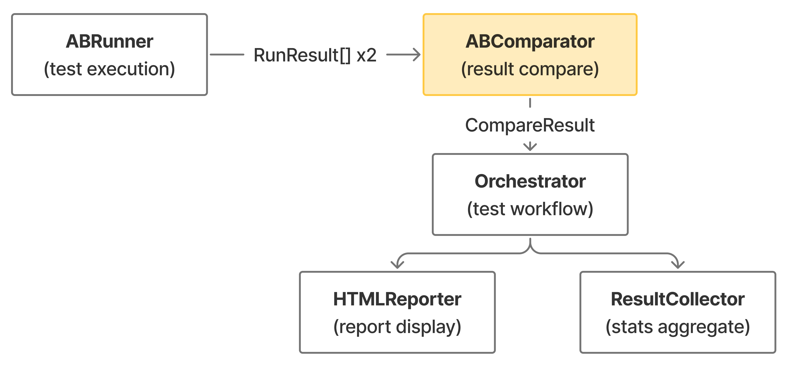
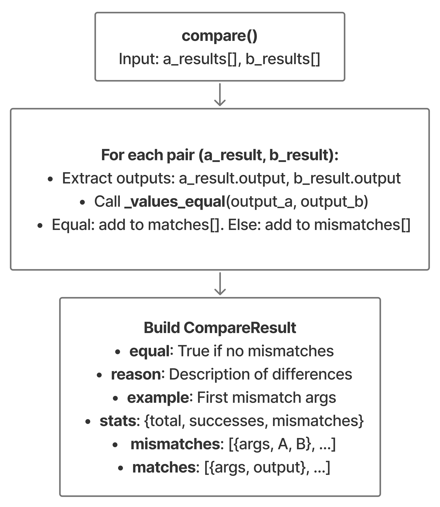
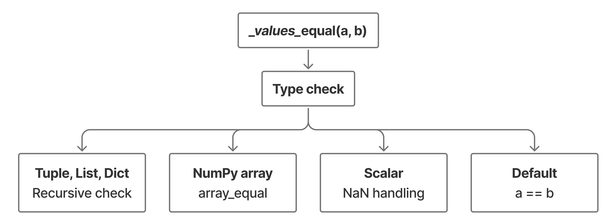

# Comparator

## Overview

The Comparator system analyzes test results from differential testing to identify behavioral differences between two code versions. It performs deep equality comparison with special handling for NumPy arrays, NaN values, and nested data structures.

## Purpose

- **Output Comparison**: Compare execution results from two code versions
- **Deep Equality**: Handle complex types (arrays, lists, dicts, tuples)
- **NaN Handling**: Treat NaN == NaN as true for numerical stability
- **Mismatch Detection**: Identify and catalog all behavioral differences
- **Match Tracking**: Record successful equivalence cases
- **Statistics Generation**: Compute match/mismatch rates and counts

## Key Components

| Component | File | Description |
|-----------|------|-------------|
| `ABComparator` | `comparator.py` | Main comparison engine for differential test results |
| `_values_equal()` | `comparator.py` | Deep equality checker with special type handling |

## Dependencies

### External Libraries

- **NumPy** (optional): For array comparison (`numpy.array_equal`)
- **math**: For NaN detection (`math.isnan`)

### Internal Components

| Component | File | Interaction |
|-----------|------|-------------|
| `ABRunner` | `abrunner.py` | Produces RunResult lists for comparison |
| `HTMLReporter` | `reporting/html_reporter.py` | Consumes CompareResult for report generation |
| `RunResult` | `contracts.py` | Input data structure (test case results) |
| `CompareResult` | `contracts.py` | Output data structure (comparison summary) |

### Data Flow



## Notes

- **Structural Equality**: Compares structure and values, not object identity
- **NaN is Equal**: Mathematical NaN values are treated as equal (important for numerical code)
- **Exception Handling**: Exceptions captured as ("exc", error_string) are compared by string value
- **No Input Checking**: Currently only compares outputs (input_check=False by default)
- **Type-Agnostic**: Handles any Python type through fallback to `==` operator

---

## How It Works

### 1. ABComparator (`comparator.py`)

The main comparison engine.

#### Initialization

```python
class ABComparator:
    def __init__(self, output_check=True, input_check=False):
        self.output_check = output_check    # Compare outputs
        self.input_check = input_check      # Compare inputs (TODO)
```

#### Main Method: `compare()`

```python
def compare(a_results, b_results) -> CompareResult:
    """
    Compare results from two test executions.

    Returns: CompareResult with mismatches, matches, and stats
    """
```

#### Comparison Flow


### 2. Deep Equality: `_values_equal()`

Recursive equality checker with special case handling.

#### Comparison Strategy



---

## CompareResult Data Structure

Output of the comparison:

```python
@dataclass
class CompareResult:
    equal: bool                          # True if no mismatches
    reason: Optional[str]                # Description of differences
    example: Optional[Any]               # First mismatch args (for quick inspection)
    stats: Dict[str, int]                # Statistics
    mismatches: List[Dict[str, Any]]     # All mismatches
    matches: List[Dict[str, Any]]        # All matches
```

---

## Statistics

The comparator calculates:

```python
stats = {
    "total_examples": len(a_results),
    "successes": count_matches,
    "mismatches": count_mismatches,
}
```

**Match rate calculation:**
```python
match_rate = (successes / total_examples * 100) if total_examples > 0 else 0
```
---

## Performance Considerations

1. **Linear Time**: O(n) where n = number of test results
2. **Deep Comparison**: Recursive for nested structures
3. **NumPy Optimization**: Uses optimized `np.array_equal()` for arrays
4. **No Short-Circuit**: Compares all results to collect complete mismatch list
5. **Memory**: Stores all mismatches and matches in memory

---

## Future Enhancements

### Input Checking (TODO)

```python
class ABComparator:
    def __init__(self, output_check=True, input_check=False):
        self.input_check = input_check  # Currently not implemented
```

**Potential use case:**
- Verify both functions receive same inputs
- Detect input mutation (functions that modify args)

---

## See Also

- [Test Runner](test-runner.md) - How test results are generated
- [Report Generation](report-generation.md) - How comparison results are displayed
- [NumPy array_equal documentation](https://numpy.org/doc/stable/reference/generated/numpy.array_equal.html)
