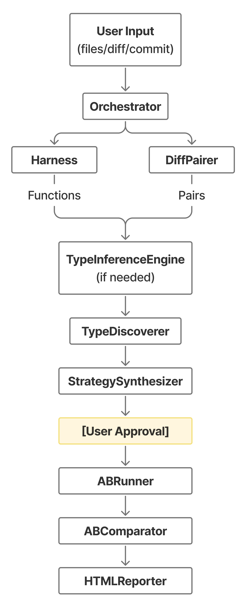

# Orchestrator

## Overview

The Orchestrator is the central coordinator that orchestrates the entire differential testing workflow. It manages the end-to-end process from loading functions, discovering types, generating test strategies, executing tests, to comparing results and generating reports. Think of it as the conductor that coordinates all the specialized components to work together harmoniously.

## Purpose

- **Workflow Coordination**: Manage the complete differential testing pipeline from start to finish
- **Component Integration**: Coordinate type inference, strategy generation, test execution, and comparison
- **Multiple Input Sources**: Support testing from function pairs, git commits, or diff files
- **User Interaction**: Handle strategy approval and configuration editing

## Key Components

| Component | File | Description |
|-----------|------|-------------|
| `Orchestrator` | `orchestrator.py` | Main coordinator class that manages the testing workflow |
| `run_pair()` | `orchestrator.py` | Run differential test on a pair of functions |
| `run_git_diff()` | `orchestrator.py` | Test modified functions from git commits |
| `run_diff_with_repo()` | `orchestrator.py` | Test from diff file with repository cloning |

## Dependencies

### External Libraries

- **os, glob**: File system operations
- **time**: Duration tracking for performance metrics
- **random**: Seed generation for reproducibility

### Internal Components

| Component | File | Interaction |
|-----------|------|-------------|
| `HarnessBuilder` | `harness.py` | Loads functions and class methods from files |
| `TypeDiscoverer` | `type_inference/type_discovery.py` | Discovers parameter and constructor types |
| `TypeInferenceEngine` | `type_inference/type_inference_engine.py` | Runs RightTyper or other type inference tools |
| `StrategySynthesizer` | `strategy/strategies.py` | Generates Hypothesis test strategies |
| `StrategySerializer` | `strategy/strategy_serializer.py` | Saves/loads strategies to/from JSON |
| `ABRunner` | `abrunner.py` | Executes differential tests with Hypothesis |
| `ABComparator` | `comparator.py` | Compares test results between versions |
| `ResultCollector` | `results.py` | Collects and formats test results |
| `HTMLReporter` | `reporting/html_reporter.py` | Generates HTML reports |
| `DiffPairer` | `diffpairer.py` | Parses git diffs to extract function pairs |
| `ProjectBuilder` | `project_builder.py` | Clones repositories and sets up environments |

### Workflow


## Notes

- **Single Entry Point**: Orchestrator is the main API users interact with
- **Flexible Input**: Accepts function pairs, git commits, or diff files
- **Interactive Mode**: Supports user approval and strategy editing
- **Automatic Mode**: Can skip approval with `auto_approve=True`
- **Reproducibility**: Generates and uses seeds for deterministic testing
- **Environment Management**: Handles virtual environments and dependency installation

---

## How It Works

### 1. Main Workflow (`run_pair()`)

The core method that coordinates differential testing on a function pair. See [orchestrator.py](../src/dt/orchestrator.py).

**Steps**:
1. **Validate test file**: Check if test file exists for type inference
2. **Build target pairs**: Load functions/methods via `HarnessBuilder`
3. **Run type inference**: Execute RightTyper if annotations missing
4. **Discover types**: Extract parameter and constructor types
5. **Generate strategy**: Create Hypothesis test strategy
6. **User approval**: Save strategy and wait for user confirmation (unless `auto_approve=True`)
7. **Execute tests**: Run differential tests via `ABRunner`
8. **Compare results**: Check for differences via `ABComparator`
9. **Collect results**: Format output via `ResultCollector`
10. **Generate report**: Create HTML report if requested

**Key Features**:
- Supports both regular functions and class methods
- Automatically reloads functions after type inference
- Allows users to edit strategy JSON before testing
- Generates random seed for reproducibility

---

### 2. Git Integration (`run_git_diff()`)

Tests modified functions from git commits. See [orchestrator.py](../src/dt/orchestrator.py).

**Steps**:
1. Parse git commit using `DiffPairer`
2. Extract modified function pairs
3. Run `run_pair()` for each modified function
4. Return list of test results

**Use Case**: Test all changes in a commit automatically

---

### 3. Repository Testing (`run_diff_with_repo()`)

Complete workflow for testing from diff file with repository context. See [orchestrator.py](../src/dt/orchestrator.py).

**Steps**:
1. **Clone repository**: Download repo from URL via `ProjectBuilder`
2. **Install dependencies**: Set up virtual environment and install requirements
3. **Find test file**: Search for test files for type inference
4. **Parse diff**: Extract modified functions via `DiffPairer`
5. **Run tests**: Execute `run_pair()` for each function in project context
6. **Cleanup**: Remove temporary files and environments

**Use Case**: Test code changes when only diff file is available

**Key Features**:
- Automatic dependency installation
- Virtual environment isolation
- Test file discovery
- Proper cleanup of temporary resources

---

## Configuration

### Initialization Options

```python
orchestrator = Orchestrator(
    log_mode=LoggerMode.Normal,           # Logging verbosity
    inference_engine=RightTyperEngine(),  # Type inference engine
    enable_strategy_extras=['numpy']      # Extra Hypothesis strategies
)
```

**Log Modes**:
- `LoggerMode.Silent`: Minimal output
- `LoggerMode.Normal`: Standard output
- `LoggerMode.Verbose`: Detailed debugging

**Inference Engines**: Pluggable via `TypeInferenceEngine` interface (RightTyper, MonkeyType, etc.)

**Strategy Extras**: Enable domain-specific strategies (numpy, pandas, etc.)

---

### Runtime Parameters

**`run_pair()` Parameters**:
- `file_a`, `file_b`: Paths to function files
- `func_name`: Name of function to test
- `max_examples`: Number of test cases (default: 200)
- `test_file`: Test file for type inference (optional)
- `auto_approve`: Skip user confirmation (default: False)
- `report_path`: Path for HTML report (optional)
- `seed`: Random seed for reproducibility (optional)

---

## User Interaction Flow

### Interactive Mode (auto_approve=False)

1. **Strategy generation**: Orchestrator generates test strategy
2. **Save to JSON**: Strategy saved to `strategy_{func_name}.json`
3. **Display to user**: Configuration printed to console
4. **Wait for input**: User can:
   - Press Enter to continue
   - Edit JSON file and press Enter to reload
   - Press Ctrl+C to cancel
5. **Reload strategy**: Load potentially modified strategy
6. **Execute tests**: Run tests with approved strategy

### Automatic Mode (auto_approve=True)

Skips steps 2-5, runs tests immediately with generated strategy.

---

## Type Inference Integration

The Orchestrator coordinates type inference seamlessly:

1. **Check if needed**: Call `inference_engine.needs_inference(fn, test_file)`
2. **Run inference**: Execute `inference_engine.run_inference(test_file)` if needed
3. **Reload functions**: Rebuild functions via `HarnessBuilder` to get updated annotations
4. **Discover types**: Extract types from updated annotations

See [Type Inference](type-inference.md) for details on the inference system.

---

## Class Method Support

For class methods (e.g., `Calculator.add()`):

1. **Detection**: `HarnessBuilder` returns `(class, method)` tuple
2. **Constructor types**: Discover types for `__init__` parameters
3. **Instance strategy**: Generate strategy for creating instances
4. **Test execution**: `ABRunner` creates instances and tests methods

---

## Error Handling

**Missing test file**: Logs warning and continues without type inference

**Type inference failure**: Logs error but continues with existing annotations

**Strategy reload failure**: Uses original strategy if JSON file missing/invalid

**Cleanup guarantee**: `try/finally` blocks ensure temporary files are removed

---

## Reproducibility

**Seed Management**:
- Auto-generated if not provided: `random.randint(0, 2**32 - 1)`
- Printed to console for reproduction
- Passed to `ABRunner` for deterministic test generation

**Example**:
```
🎲 Generated random seed: 1234567890
   To reproduce: --seed 1234567890
```

---

## Performance Tracking

Orchestrator tracks execution duration:
```python
start_time = time.time()
# ... execute tests ...
duration = time.time() - start_time
```

Duration included in HTML reports for performance analysis.

---

## HTML Report Generation

When `report_path` provided, generates comprehensive HTML report via `_generate_html_report()`:
- Test results (pass/fail)
- Mismatch examples with inputs/outputs
- Strategy configuration
- Execution duration
- Reproduction command
- Warnings collected during execution

See [Report Generation](report-generation.md) for details.

---

## See Also

- [Type Inference](type-inference.md) - How types are discovered and inferred
- [Strategy System](strategy-system.md) - How test strategies are generated
- [Test Runner](test-runner.md) - How tests are executed
- [Comparator](comparator.md) - How results are compared
- [Report Generation](report-generation.md) - How reports are created
