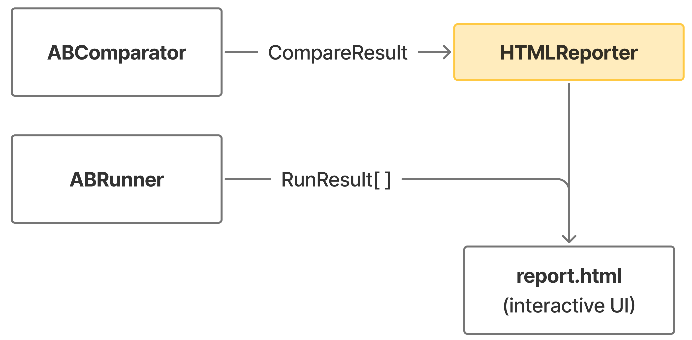

# Report Generation

## Overview

The Report Generation system creates self-contained HTML reports from differential testing results using Jinja2 templates with search, filtering and collapsible sections.

## Purpose

- **Visual Summary**: Present results in an accessible, interactive format
- **Detailed Analysis**: Display all mismatches and matches with full context
- **Instance Analytics**: Per-instance statistics for class method testing
- **Reproducibility**: Include metadata needed to reproduce tests
- **Shareability**: Single HTML file with no external dependencies

## Key Components

| Component | File | Description |
|-----------|------|-------------|
| `HTMLReporter` | `html_reporter.py` | Main report generator |
| `report.html` | `templates/report.html` | Jinja2 template (710 lines: 445 CSS, 200 HTML, 65 JS) |
| `ResultCollector` | `results.py` | Formats and aggregates results |

## Dependencies

### External Libraries

- **Jinja2**: Template engine
- **datetime**, **json**: Metadata and serialization

### Internal Components

| Component | File | Interaction |
|-----------|------|-------------|
| `ABComparator` | `comparator.py` | Provides CompareResult with mismatches/matches |
| `ABRunner` | `abrunner.py` | Provides RunResult lists and warnings |
| `StrategySerializer` | `strategy/strategy_serializer.py` | Serializes strategies for display |

### Data Flow



## Notes

- **Self-Contained**: All CSS and JavaScript inline, works offline
- **Dark Mode**: Auto-adapts to system theme via CSS variables
- **Optimized**: Scrollable tables, matches limited to 100 displayed

---

## How It Works

### HTMLReporter (`html_reporter.py`)

#### Main Method: `generate_report()`

```python
def generate_report(test_result, a_results, b_results, strategy, config,
                   command, duration, output_path):
    # 1. Prepare context
    context = self._prepare_context(...)

    # 2. Render template
    template = self.env.get_template('report.html')
    html_content = template.render(**context)

    # 3. Write to file
    with open(output_path, 'w') as f:
        f.write(html_content)
```

#### Context Structure

```python
context = {
    # Metadata
    'function_name', 'class_name', 'file_a', 'file_b', 'timestamp', 'duration', 'command',

    # Statistics
    'stats': {'total', 'mismatches', 'successes', 'match_rate'},

    # Results
    'mismatches': formatted_mismatches,  # All mismatches
    'matches': formatted_matches,        # Limited to 100
    'instance_stats': per_instance_data, # For class methods

    # Configuration
    'strategy_json', 'max_examples', 'seed',

    # Other
    'warnings', 'passed'
}
```

### Result Formatting

Results are formatted with:
- Arguments as formatted strings: `"x=5, y=3"`
- Outputs with HTML styling: `<span class='output-status return'>Return:</span> 8`
- Instance info (class methods): `"Calculator(precision=2)"`

### Instance Statistics (Class Methods)

Per-instance metrics calculated:
- Total tests per instance
- Mismatches and matches counts
- Mismatch rate percentage
- Progress bar visualization

---

## Interactive Features

### Search and Filtering

```javascript
function filterRows() {
    const searchTerm = searchInput.value.toLowerCase();
    const instanceId = instanceFilter.value;

    mismatchRows.forEach(row => {
        const matchesSearch = !searchTerm || row.textContent.toLowerCase().includes(searchTerm);
        const matchesInstance = instanceId === 'all' || row.dataset.instanceId === instanceId;

        row.classList.toggle('hidden', !(matchesSearch && matchesInstance));
    });
}
```

**Features**: Search text, filter by instance, clear filters button

### Collapsible Sections

```html
<details class="section" open>
  <summary>❌ Mismatches (5)</summary>
  <div class="content">...</div>
</details>
```

**Default States**:
- Configuration: Collapsed
- Mismatches: **Open** (if any)
- Matches: Collapsed
- Warnings: **Open** (if ExecutionError)

---

## Example Usage

```python
from dt.reporting.html_reporter import HTMLReporter

reporter = HTMLReporter()
report_path = reporter.generate_report(
    test_result=test_result,
    a_results=a_results,
    b_results=b_results,
    strategy=strategy_plan,
    config=run_config,
    command="python run_ab.py --a a.py --b b.py --func add",
    duration=2.5,
    output_path="report.html"
)
```

## See Also

- [Test Runner](test-runner.md) - How test results are generated
- [Comparator](comparator.md) - How results are compared
- [Jinja2 Documentation](https://jinja.palletsprojects.com/)
