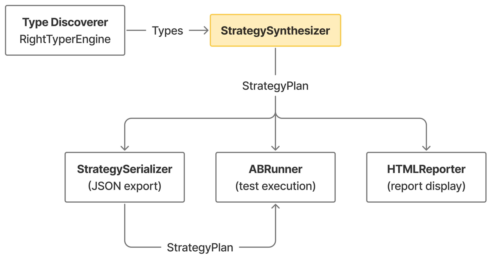
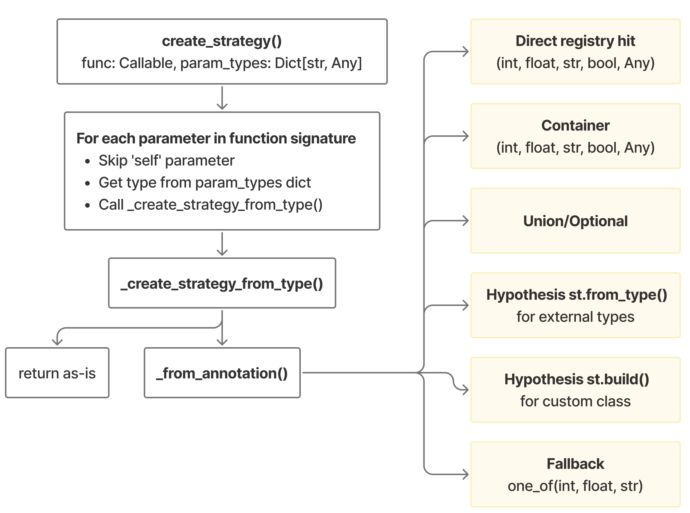

# Strategy System

## Overview

The Strategy System is the core component responsible for generating Hypothesis test strategies from Python type information. It automatically creates appropriate test data generators based on function signatures and type annotations, enabling property-based differential testing without manual strategy definition.

## Purpose

- **Automatic Strategy Generation**: Convert Python types to Hypothesis strategies
- **Class Method Support**: Generate both instance strategies and method argument strategies for testing class methods
- **Serialization**: Save and load strategies as JSON for review, modification, and reproducibility
- **Configurability**: Allow customization of strategy parameters through configuration classes and JSON files

## Key Components

| Component | File | Description |
|-----------|------|-------------|
| `StrategySynthesizer` | `strategies.py` | Main class that converts types to Hypothesis strategies |
| `StrategyConfig` | `strategy_config.py` | Configuration class defining default strategy parameters |
| `StrategySerializer` | `strategy_serializer.py` | Handles JSON serialization/deserialization of strategies |
| `InstanceStrategyPlanner` | `instance_planner.py` | Plans instance distribution for class method testing |

## Dependencies

### External Libraries

- **Hypothesis**: Property-based testing library (`hypothesis.strategies`)
- **Python typing module**: For handling type annotations (`typing.get_origin`, `typing.get_args`)
- **inspect**: For function signature introspection

### Internal Components

| Component | File | Interaction |
|-----------|------|-------------|
| `Orchestrator` | `orchestrator.py` | Creates `StrategySynthesizer` and `StrategySerializer`, coordinates strategy generation workflow |
| `TypeDiscoverer` | `type_inference/type_discovery.py` | Provides parameter types that `StrategySynthesizer` converts to strategies |
| `TypeInferenceEngine` | `type_inference/type_inference_engine.py` | Abstract interface for type inference, feeds types to strategy system |
| `RightTyperEngine` | `type_inference/righttyper_engine.py` | Concrete type inference implementation using RightTyper |
| `TestRunner` | `test_runner.py` | Consumes `StrategySynthesizer` to generate strategies during test execution |
| `HTMLReporter` | `reporting/html_reporter.py` | Serializes `StrategyPlan` for display in HTML reports |
| `StrategyPlan` | `contracts.py` | Data contract shared between strategy system and consumers |

### Data Flow



## Notes

- The strategy system is designed to be **type-driven** - all type resolution happens in the Type Inference layer before reaching the Strategy System
- Strategies are **serializable to JSON**, allowing users to review and customize them before test execution
- For class methods, the system uses a **square root heuristic** to balance instance diversity with test depth
- The system supports **extra Hypothesis modules** like `hypothesis.extra.numpy` for specialized types

---

## How It Works

### 1. StrategySynthesizer (`strategies.py`)

The `StrategySynthesizer` class is the main entry point for strategy generation.

#### Initialization

```python
synthesizer = StrategySynthesizer(config=StrategyConfig)
```

The synthesizer accepts an optional `config` class to customize default strategy parameters.

#### Strategy Creation Flow


#### Type to Strategy Mapping

| Python Type | Hypothesis Strategy |
|-------------|---------------------|
| `int` | `st.integers(min_value=-50, max_value=50)` |
| `float` | `st.floats(min_value=-50.0, max_value=50.0)` |
| `str` | `st.text(max_size=10)` |
| `bool` | `st.booleans()` |
| `List[T]` | `st.lists(strategy_for_T, max_size=10)` |
| `Set[T]` | `st.sets(strategy_for_T, max_size=10)` |
| `Dict[K, V]` | `st.dictionaries(key_strat, value_strat, max_size=10)` |
| `Tuple[T1, T2]` | `st.tuples(strat_T1, strat_T2)` |
| `Optional[T]` | `st.none() \| strategy_for_T` |
| `Union[T1, T2]` | `st.one_of(strat_T1, strat_T2)` |
| Custom class | `st.builds(CustomClass, **constructor_strategies)` |

#### Class Method Handling

When testing class methods, the synthesizer:

1. Creates an **instance strategy** using `st.builds()` with constructor parameter strategies
2. Uses `InstanceStrategyPlanner` to calculate how many unique instances to generate
3. Returns a `StrategyPlan` containing both instance and argument strategies

---

### 2. StrategyConfig (`strategy_config.py`)

Defines default values for all strategy parameters.

#### Key Configuration Values

```python
class StrategyConfig:
    # Integer bounds
    INT_MIN_VALUE = -50
    INT_MAX_VALUE = 50

    # Float bounds
    FLOAT_MIN_VALUE = -50.0
    FLOAT_MAX_VALUE = 50.0
    FLOAT_ALLOW_NAN = False
    FLOAT_ALLOW_INFINITY = False

    # String configuration
    STRING_MAX_SIZE = 10

    # Container sizes
    LIST_MAX_SIZE = 10
    SET_MAX_SIZE = 10
    DICT_MAX_SIZE = 10
    TUPLE_MAX_SIZE = 5
```

#### Customization

Create a subclass to override defaults:

```python
class MyConfig(StrategyConfig):
    INT_MIN_VALUE = -1000
    INT_MAX_VALUE = 1000
    LIST_MAX_SIZE = 20

synthesizer = StrategySynthesizer(config=MyConfig)
```

---

### 3. StrategySerializer (`strategy_serializer.py`)

Handles conversion between `StrategyPlan` objects and JSON-serializable dictionaries.

#### Serialization Flow

```
StrategyPlan --> strategy_to_dict() --> JSON file
                                            |
                                            v
                                       User edits
                                            |
                                            v
JSON file --> dict_to_strategy() --> StrategyPlan
```

#### Introspection

The serializer uses **strategy introspection** to extract configuration from Hypothesis strategy objects:

1. **LazyStrategy** (most common): Access internal `function`, `__args`, and `__kwargs`
2. **Direct strategies**: Extract attributes like `min_value`, `max_value`, `elements`
3. **Chained methods** (map, filter): Stored as repr strings with caching

#### Extra Strategy Modules

The serializer supports optional Hypothesis extras:

```python
EXTRA_STRATEGY_MODULES = {
    "numpy": "hypothesis.extra.numpy",
    "pandas": "hypothesis.extra.pandas",
    "django": "hypothesis.extra.django",
    # ...
}
```

---

### 4. InstanceStrategyPlanner (`instance_planner.py`)

Plans how to distribute test instances for class method testing.

#### Distribution Algorithm

```python
def calculate_distribution(max_examples, constructor_types):
    # If no constructor params -> use 1 instance
    if not constructor_types:
        return 1, max_examples

    # Square root heuristic for balanced diversity/depth
    ideal_instances = sqrt(max_examples)

    # Apply constraints
    num_instances = min(ideal_instances, MAX_INSTANCES)  # Cap at 20
    num_instances = max(num_instances, max_examples // MIN_EXAMPLES_PER_INSTANCE)

    examples_per_instance = max_examples // num_instances
    return num_instances, examples_per_instance
```

#### Configuration Constants

| Constant | Value | Description |
|----------|-------|-------------|
| `MIN_INSTANCES` | 1 | Minimum instances to test with |
| `MAX_INSTANCES` | 20 | Maximum instances (avoid sparse testing) |
| `MIN_EXAMPLES_PER_INSTANCE` | 5 | Minimum tests per instance |

#### Example Distribution

| max_examples | num_instances | examples_per_instance |
|--------------|---------------|----------------------|
| 100 | 10 | 10 |
| 200 | 14 | 14 |
| 500 | 20 | 25 |
| 1000 | 20 | 50 |

---

## StrategyPlan Data Structure

The output of the strategy system is a `StrategyPlan` object:

```python
@dataclass
class StrategyPlan:
    arg_strategy: st.SearchStrategy      # Combined strategy for all parameters
    param_strategies: Dict[str, st.SearchStrategy]  # Individual strategies by param name
    instance_strategy: Optional[st.SearchStrategy]  # For class methods
    num_instances: Optional[int]         # Number of unique instances to generate
```

---

## See Also

- [Strategy Customization Guide](strategy-customization.md) - How to customize the generated strategy JSON files
- [Type Inference](type-inference.md) - How types are discovered before strategy generation
- [Test Runner](test-runner.md) - How strategies are executed during testing
