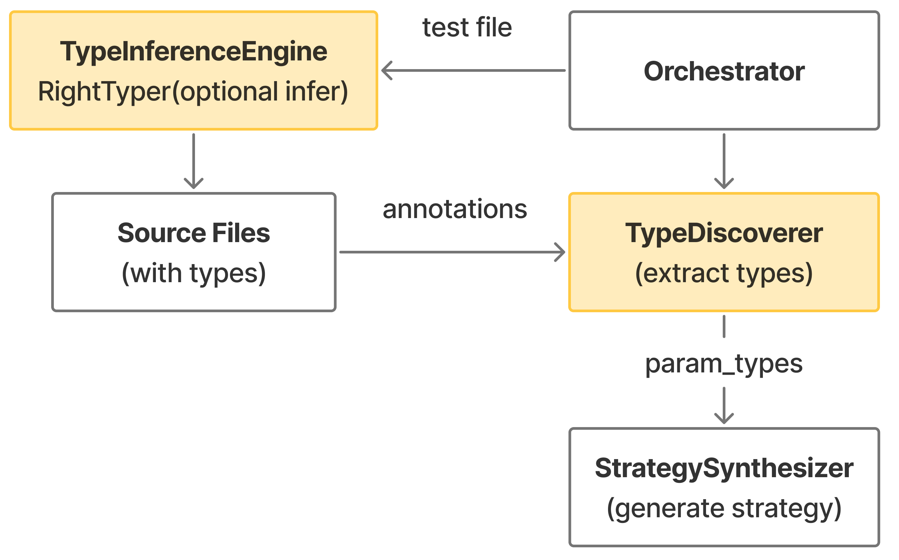
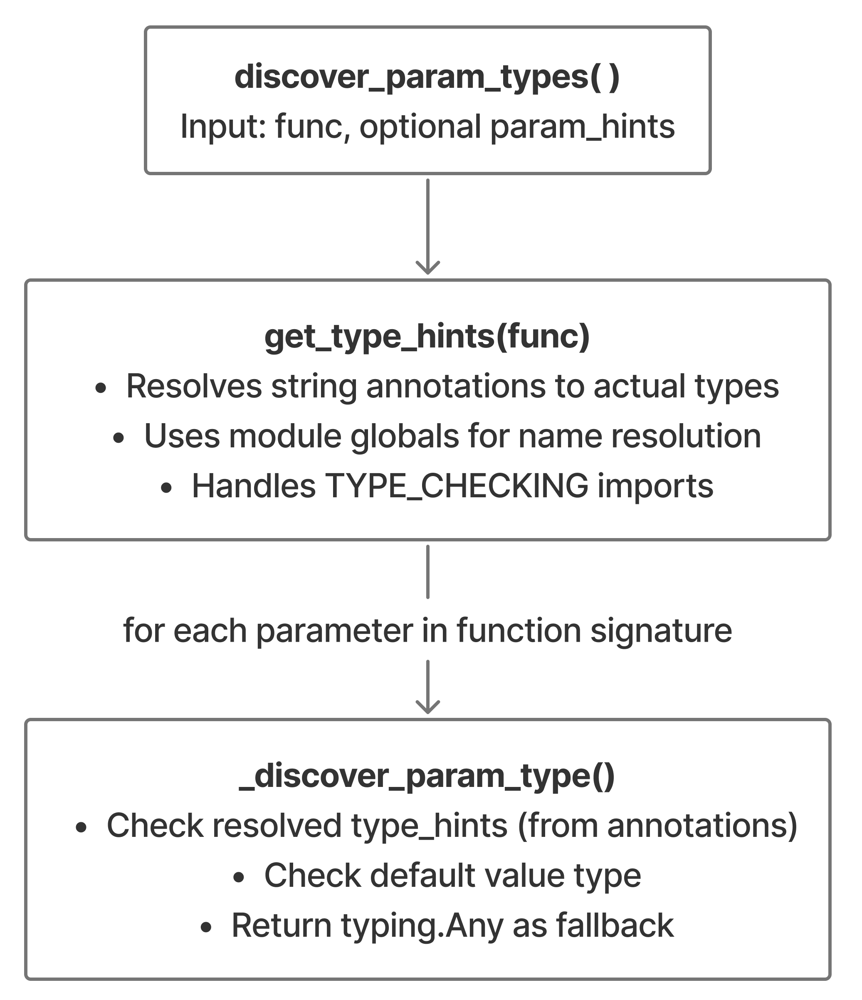

# Type Inference

## Overview

The Type Inference system is responsible for discovering and inferring type information for Python function parameters. It combines multiple approaches: analyzing existing type annotations, leveraging dynamic type inference tools like RightTyper, and providing fallback mechanisms to ensure every parameter has a usable type for strategy generation.

## Purpose

- **Type Discovery**: Extract type information from existing annotations, default values, and manual hints
- **Automatic Type Inference**: Use dynamic analysis tools to infer types from test execution traces
- **String Annotation Resolution**: Resolve forward references and string annotations to actual type objects
- **Constructor Type Analysis**: Discover types for class constructors to enable instance generation
- **Pluggable Architecture**: Support multiple type inference engines through abstract interfaces

## Key Components

| Component | File | Description |
|-----------|------|-------------|
| `TypeDiscoverer` | `type_discovery.py` | Discovers type information from annotations, hints, and defaults |
| `TypeInferenceEngine` | `type_inference_engine.py` | Abstract base class for pluggable type inference tools |
| `RightTyperEngine` | `righttyper_engine.py` | RightTyper implementation for dynamic type inference |

## Dependencies

### External Libraries

- **Python typing module**: For type hint resolution (`typing.get_type_hints`)
- **inspect**: For function signature and module introspection
- **RightTyper** (optional): Dynamic type inference tool by AWS

### Internal Components

| Component | File | Interaction |
|-----------|------|-------------|
| `Orchestrator` | `orchestrator.py` | Creates and coordinates `TypeDiscoverer` and `TypeInferenceEngine` |
| `StrategySynthesizer` | `strategy/strategies.py` | Consumes discovered types to generate Hypothesis strategies |
| `TestRunner` | `test_runner.py` | May trigger type inference before test execution |

### Data Flow


## Notes

- **Separation of Concerns**: Type **inference** (adding annotations) and type **discovery** (reading annotations) are separate
- **Pluggable Engines**: New type inference tools can be added by implementing `TypeInferenceEngine`
- **Runtime Resolution**: Uses `get_type_hints()` to properly resolve string annotations and forward references
- **Constructor Support**: Can analyze class `__init__` methods for instance generation in class method testing
- **Fallback to Any**: If no type information is found, defaults to `typing.Any` to ensure testing can proceed

---

## How It Works

### 1. TypeDiscoverer

Extracts type information from existing code without modifying it. See [type_discovery.py](../src/dt/type_inference/type_discovery.py).

**Core Methods**:
- `discover_param_types(func, param_hints=None)`: Discovers types using priority order (annotations → defaults → typing.Any)
- `discover_constructor_types(cls, param_hints=None)`: Discovers constructor parameter types for instance generation
- `_resolve_string_annotation(annotation, module)`: Resolves forward references, module aliases, and complex generics

**Process Flow:**



---

### 2. TypeInferenceEngine

Abstract base class defining the interface for pluggable type inference tools. See [type_inference_engine.py](../src/dt/type_inference/type_inference_engine.py).

Follows **Strategy Pattern** to allow different implementations:
- `needs_inference(func, test_file)`: Check if function needs type inference
- `run_inference(test_file)`: Run inference tool to add annotations
- `get_engine_name()`: Return human-readable engine name

---

### 3. RightTyperEngine

Concrete TypeInferenceEngine implementation using AWS [RightTyper](https://github.com/RightTyper/RightTyper). See [righttyper-exploration.md](righttyper-exploration.md). See [righttyper_engine.py](../src/dt/type_inference/righttyper_engine.py).

**How It Works**:
1. Executes test file to trace function calls
2. Analyzes runtime types
3. Modifies source files to add type annotations

**Requirements**:
- Python 3.11+
- RightTyper installed: `pip install git+https://github.com/GrammaTech/righttyper.git`
- Test file that exercises target functions

**Example**:
```python
# Before: def has_close_elements(numbers, threshold):
# After:  def has_close_elements(numbers: list[float], threshold: float) -> bool:
```

---

## Integration with Orchestrator

The Orchestrator coordinates type inference and discovery (see [orchestrator.py](../src/dt/orchestrator.py)):
1. Check if inference needed via `needs_inference()`
2. Run inference via `run_inference()`
3. Reload module to get updated annotations
4. Discover types via `discover_param_types()`
5. Generate strategies for testing

---

## Type Discovery Priority

1. **Annotations** (highest): Explicit type hints in function signature
2. **Default values**: Type inferred from default parameter values
3. **Fallback to Any** (lowest): Ensures testing can always proceed

---

## Adding New Type Inference Engines

Implement `TypeInferenceEngine` abstract class with required methods, then use in Orchestrator:
```python
orchestrator = Orchestrator(inference_engine=YourEngine())
```

**Common patterns**:
- **Static analyzers** (Pytype, Pyre): No code execution
- **Dynamic tracers** (RightTyper, MonkeyType): Execute tests and trace runtime types
- **Hybrid approaches**: Combine both methods

---

## Error Handling

**NameError Resolution**: When `get_type_hints()` fails, falls back to manual string annotation resolution via `_resolve_string_annotation()`.

**Missing Type Information**: Returns `typing.Any` as fallback to ensure strategy generation can proceed.

---

## Performance Considerations

1. **Type Inference is Optional**: Only runs when needed (missing annotations + test file provided)
2. **Cached Module Globals**: `get_type_hints()` uses cached module dictionaries
3. **Lazy Resolution**: String annotations resolved on-demand during discovery
4. **Minimal Overhead**: TypeDiscoverer is lightweight introspection

---

## See Also

- [Strategy System](strategy-system.md) - How discovered types are converted to Hypothesis strategies
- [Test Runner](test-runner.md) - How type inference integrates with test execution
- [RightTyper Documentation](https://github.com/GrammaTech/righttyper) - Official RightTyper documentation
